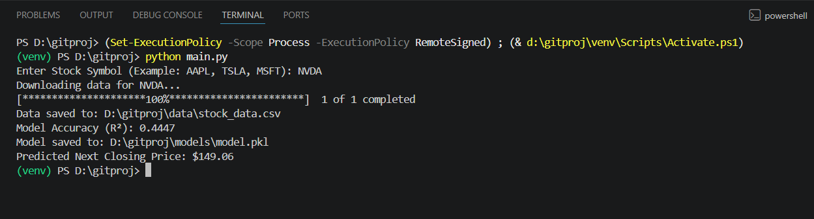

# 📈 Stock Price Predictor

A Machine Learning-based stock price prediction system that analyzes historical stock market data and predicts future closing prices using Linear Regression.

The project demonstrates the complete machine learning workflow including data preprocessing, feature selection, model training, evaluation, and prediction.

### Key Features

* Historical stock data analysis
* Data preprocessing and cleaning
* Feature engineering using market indicators
* Linear Regression model training
* Model evaluation using R² Score
* Future stock closing price prediction
* Modular and scalable project structure

### Technologies Used

* Python
* Pandas
* NumPy
* Scikit-Learn
* Pickle

### Future Enhancements

* Streamlit Dashboard
* Interactive Visualizations
* LSTM Neural Networks
* XGBoost Regression
* Technical Indicators (RSI, MACD)
* Real-time Prediction Interface

---

## 📂 Project Structure

```text
Stock-price-predictor/
│
├── main.py
├── requirements.txt
├── README.md
│
├── data/
│   └── stock_data.csv
│
├── models/
│   └── model.pkl
│
└── src/
    ├── data_loader.py
    ├── train_model.py
    └── predict.py
```

---

## ⚙️ Installation

### 1. Clone the Repository

```bash
git clone https://github.com/Arjun-061/Stocks_value_predictor.git
cd Stocks_value_predictor
```

### 2. Create a Virtual Environment

```bash
python -m venv venv
```

### 3. Activate Virtual Environment

Windows:

```bash
venv\Scripts\activate
```

Linux/macOS:

```bash
source venv/bin/activate
```

### 4. Install Dependencies

```bash
pip install -r requirements.txt
```

## Prediction Result


---

## 📊 Machine Learning Workflow

1. Load and preprocess historical stock data
2. Clean and preprocess data
3. Select features:

   * Open
   * High
   * Low
   * Volume
4. Split dataset into training and testing sets
5. Train Linear Regression model
6. Evaluate model performance using R² Score
7. Predict the next closing stock price

---

## 📈 Example Stocks

| Company                   | Symbol      |
| ------------------------- | ----------- |
| Apple                     | AAPL        |
| Microsoft                 | MSFT        |
| NVIDIA                    | NVDA        |
| Tesla                     | TSLA        |
| Amazon                    | AMZN        |
| Meta                      | META        |
| Reliance Industries       | RELIANCE.NS |
| Tata Consultancy Services | TCS.NS      |
| Infosys                   | INFY.NS     |

---

## 📜 License

This project is developed for educational and learning purposes.

---

## 👨‍💻 Author

**Arjun**

Computer Science Engineering Student

GitHub: https://github.com/Arjun-061
